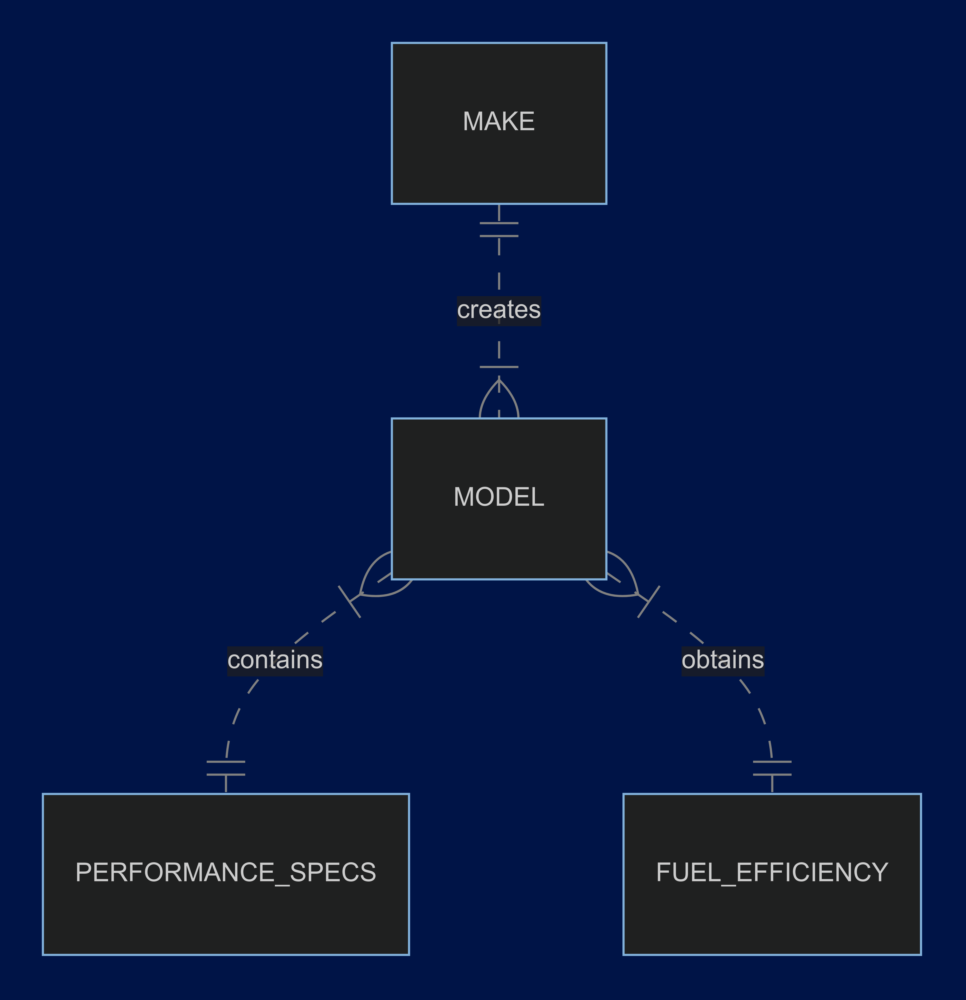

# Design Document

By Ethan Fong

Video overview: <https://youtu.be/eeZ3NUqzS6g?si=4I1Jtx7vxEmZCDhi>

## Scope

I specifically aimed for my database to be a one-stop repository for all the important details that people would want
want to know about virtually any car model released. Given that in mind, it was important for me to decide on the most
important information that ought to be included, since I've designed the database to primarily be used by anyone
wanting to search up a car's specific make and model. Thus, I've not only compiled a list of manufacturers (makes)
and their respective offerings (models), but I've also ensured that these two categories of information were supplemented by information such as car specifications (transmission, engine cylinders, type of engine, etc.) and even
fuel information (type of fuel used, gas mileage, etc.).

The scope of my database specifically includes all car models ever mass-released from the year 1984 up to the present
day, along with their key specifications. Additionally, as I've mentioned earlier, the list also includes all key
car manufacturers that have manufactured these respective cars. Given that, I think that this list would prove most useful to car enthusiasts, potential car buyers, and even those working in automotive-related industries like repair shops, dealerships, and more.

On the consumer side, I think that car enthusiasts have a lot to gain from the list because it contains key information for each car model by year, which would prove helpful for them to continue broadening their car-related knowledge. Similarly, I also see that the information I've listed will also prove helpful to car buyers because the list contains automobiles spanning a wide range of types, configurations, and specifications, meaning that potential car buyers would find the list useful in helping them identify potential car models that fit their needs.

On the business side, I also see the relevance of the list towards people who are employed in the automotive industry, or in automotive-industry related businesses like repair shops, dealerships, and even the car manufacturers themselves. Although people working in these industries would already possess a wide range of knowledge when it comes to cars, I think that this database may still be helpful for them if they need to fact-check certain car specs, or if they simply want to dig out more information about a particular car model or car model year that would hepl them accomplish their respective tasks or projects.

However, of course I also acknowledge that this database may not meet everyone's specific needs. For instance, I think that people who are looking for specific performance-related information about a car, such as its top speed, 0-60 times, or how many Gs of force it can take when cornering, is absent. It was difficult for me to find this kind of information in a database or CSV format, so I have decided to exclude this category of data from the database. I also note that people who would be looking for information about cars or car brands before 1984 would not find what they need from this database. Because I lifted the information from an online database I found, I'd assume that the information that they have assembled or compiled was only available electronically starting in 1984, hence, they'd have to make the hard choice of not putting in information about cars from years prior to 1984, as it would be hard to retrieve.

## Functional Requirements

This database allows users to query for important information regarding specs and fuel efficiency for any car model created after 1984. I've painstakingly ensured that the database contains just the right amount of information, in that it contains enough information to be a rich repository for anyone looking to know more about a specific car model for a specific year, yet it doesn't contain irrelevant information that will not serve most viewers any real purpose, and will only seek to slow down any querying done with the database. Ultimately, I hope that this database serves as a great repository for users to obtain the necessary information they need about a specific car model in a quick and efficient manner.

As previously mentioned, the scope of this database is constrained by two important parameters. The first is that this database only contains car models manufactured from 1984 onwards. Therefore, any user who is interested to learn more about a car made before 1984 will not find the information that they need here. Another significant limitation is that this database may be missing some specifications that other users need, like car performance metrics. Compared to the first constraint, I don't think that this is a significant one since this information is on the niche side, but at the same time I recognize that users who need this kind of information will not find it within this repository.

## Representation

### Entities

This database contains four entities that I've categorized into four separate tables, namely a car's make (or manufacturer), its respective model, pertinent car specifications, and a car's fuel efficiency. I can't say much for both the "make" and the "model" tables, since these tables only contain two columns each, namely, the ID to serve as a unique identifier for every row, and the "make" and the "model" of the vehicle in question, respectively.

Car specifications contains much more columns than either "make" or "model". As the name implies, it contains all the important technical specifications about a car that one might be interested in. Specifically, I chose to include information regarding a car's cylinders, its engine displacement, its drivetrain, the kind of fuel it uses, its transmission, the type of vehicle it is, and the year it was manufactured. Fuel efficiency is also roughly as detailed as "car specifications", though with information that focuses on a car's fuel efficiency instead, such as its estimated annual fuel consumption, its mileage with city driving, its mileage with highway driving, and its mileage with combined city and highway driving.

These columns have varying data types. Unique identifiers, like ID, the Model ID, and the Make ID are represented as integers since they cannot have decimals. Information best provided with textual strings, like cylinders, a car's make and model, and fuel type, for instance, are all represented by the "text" data type. Lastly, there are a variables, like engine displacement and annual fuel consumption, that I decided is best represented by the numeric data type since both these variables contain decimals.

In terms of constraints, I only used one, which is "NOT NULL". I initially incorporated other constraints like "UNIQUE" and "CHECK", but I quickly found out when test querying that both of them would not work with my database. Most of the possible entries for the columns are characteristics that are commonly shared by many other vehicles, so I could not use "UNIQUE" without seriously affecting my database. Similarly, I initially thought that "CHECK" would work out, but I quickly found out that the database itself contains some missing entries, hence, I found that these records would not appear because of the "CHECK" constraint.

### Relationships

The below ER diagram describes the relationship among the entities in the database.

As explained by the ER diagram above, there are three notable relationships shared among the four tables present in the database.

Make and Model share a one-to-many between each other. Specifically, a car's make, or manufacturer, creates a car model. But most makes actually end up producing not just one model, but many, hence the many symbol present on the model side. Conversely, a specific model can only be created by one make. As the database only takes mass-produced vehicles into account, it is not possible within these constraints for a model to not belong to any make, hence, the "only one" symbol present on the make side.

Model and Performance Specs share a many-to-one relationship between each other. Each car model, as a consumer-ready product, will always contain a specific set of features designed to fit the needs of a specific segment of buyers. It is not possible for a car model to be devoid of any specifications, but at the same time, a specific model can only have a specific set of specs out of the factory, hence, it contains a only one symbol on the performance specs side. On the other hand, performance specs, or the values that help form performance specs within the database, are not unique to one car. For instance, there are many cars with 4 cylinders that are also FWD. Hence, this lends itself to a many symbol on the side of the model, as many cars may have certain specs that are similar to others.

The same actually goes for Fuel Efficiency, in that a model can only have one set of values for fuel efficiency, but more than one car can share a value for actual gas mileage, hence, the many-to-one relationship between model and fuel efficiency.

## Optimizations

I created two views to aid users in visualizing what they're querying, namely, "car_performance_specs" and "car_fuel_efficiency". I created these views because by defaut, users will not be able to view a car's specific make and model titles when viewing the "performance_specs" or "fuel_efficiency" tables, only their respective IDs. Hence, I've made it so that querying for the "make" and "model" within these views make it possible to actually show the car's respective "make" and "model" alongside the ID values.

Because the full database contains more than 47000 records, enabling the timer showed me that the query times without incorporating indexes roughly take about 2 or 3 tenths of a second, which is a problematic speed if many users start querying the database simultaneously. To remedy this, I've created two covering indexes, one for the make and model ID of performance specs, and one for the make and model ID belonging to fuel efficiency. Using the QUERY PLAN command revealed that the database makes good use for these indexes, and hence, has made querying much faster within the database.

## Limitations

As previously mentioned in the Scope portion of this Design Document, my design contains two major limitations. One is that it does not contain cars that were manufactured before 1984, and another being that it deliberatly does not contain more "niche" information such as a car's performance metric specs, among other. In connection to that, I can say that my database does not represent two things very well. One is cars manufactured before 1984, and one is additional specifications that may be of interest to some users.
